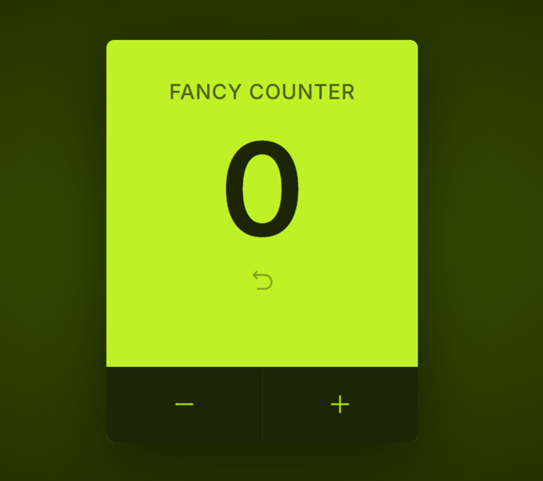

# 🎨 Fancy Counter

### Fancy Counter is a sleek and responsive counter application built with React. It allows users to increment, decrement, and reset the counter seamlessly. You can also press the <b> Spacebar </b> to increase the count.



## 🔗 <a href="https://fancy-counter-gobi.netlify.app/" target="_blank" rel="noopener noreferrer">View on Netlify</a>

## 🚀 Features

- Increment and decrement functionality
- Reset button to set the counter back to zero
- Press <b>Spacebar</b> to increase the count
- Fully responsive design

## 📌 Getting Started

### 1️⃣ Clone the Repository

```sh
git clone https://github.com/gobimahato/fancy-counter.git
cd fancy-counter
```

### 2️⃣ Install Dependencies

```sh
npm install
```

### 3️⃣ Run the Application

```sh
  npm run dev
```

Your app will now be live at http://localhost:5173/ (or the displayed URL).

### 📜 License

This project is licensed under the MIT License.
